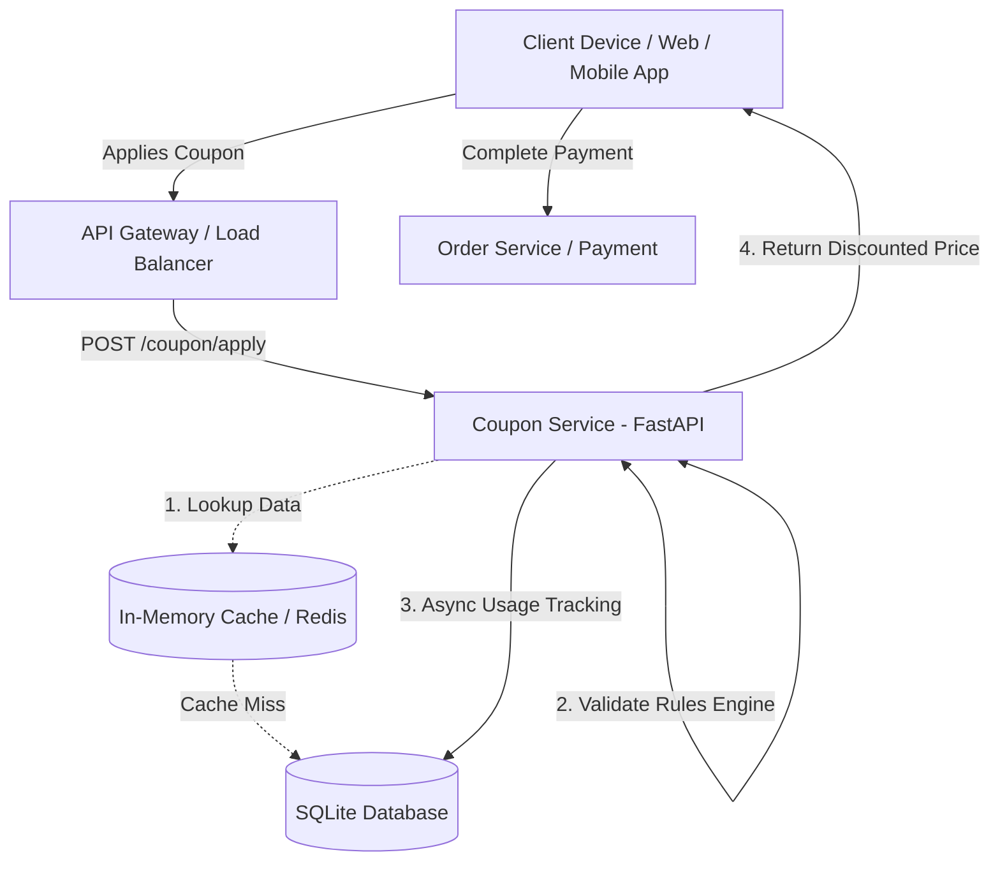
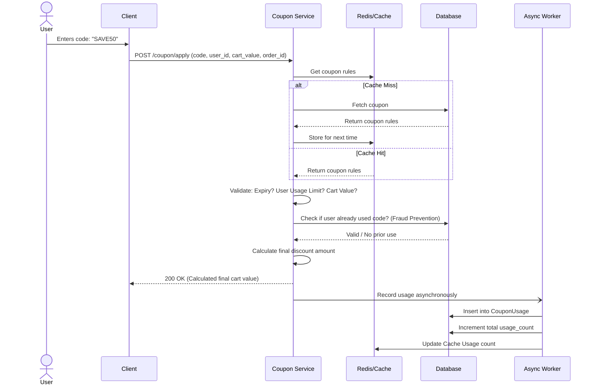

# System Architecture & Diagrams

Below are the architectural representations of the Coupon Management & Redemption System.

## 1. High-Level Architecture Diagram
This diagram shows the main components of the system and how they interact.

## 2. Sequence Flow Diagram
This details the exact step-by-step transaction when a user applies a discount during checkout.

