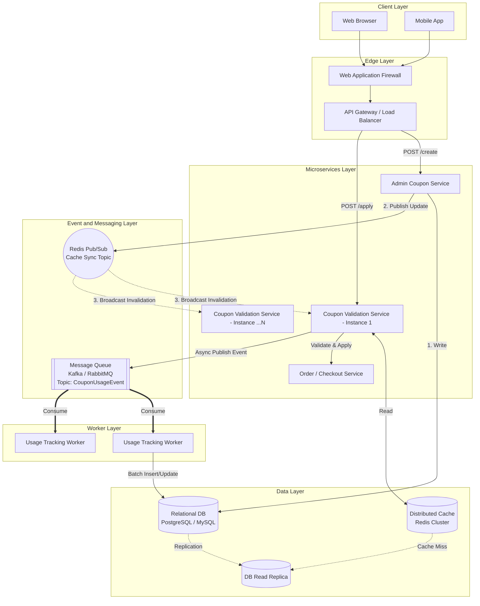
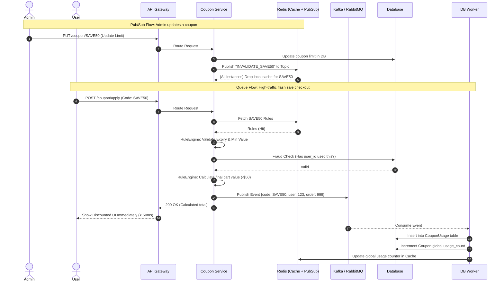

# System Architecture & Diagrams

Below are the highly detailed architectural representations of the Coupon Management & Redemption System, specifically incorporating advanced distributed system patterns such as Message Queues and Pub/Sub caching mechanisms.

## 1. High-Level Design (HLD) Architecture
This diagram illustrates how the system scales horizontally and uses asynchronous messaging (Queues) and Pub/Sub for eventual consistency and fast read synchronization.

## 2. Low-Level Design (LLD): Component & Data Flow
This details the internal classes, methods, and rule engine logic inside the Validation Service, including how payloads are structured and pushed to the queue.

## 3. Detailed Sequence Diagram (Pub/Sub & Queues)
This sequence shows the exact lifecycle of an Admin updating a coupon (Pub/Sub) and a User applying a coupon (Message Queue).

