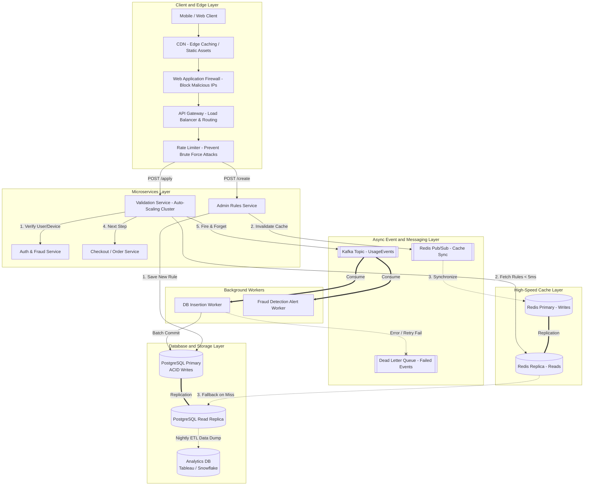
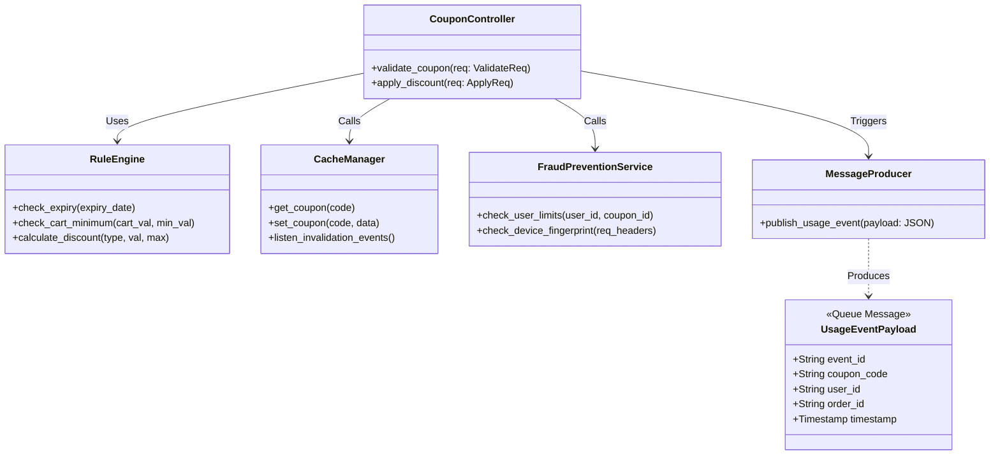
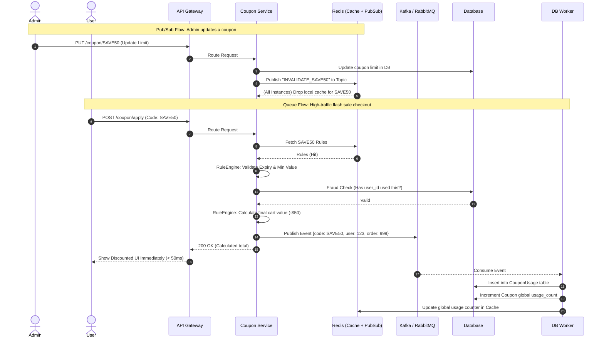

# System Architecture & Diagrams

Below are the highly detailed architectural representations of the Coupon Management & Redemption System, specifically incorporating advanced distributed system patterns such as Message Queues and Pub/Sub caching mechanisms.

## 1. High-Level Design (HLD) Architecture
This diagram illustrates an enterprise-grade, highly scalable distributed system. It includes aggressive edge-caching, rate limiting, independent scaling of reads vs writes, dead letter queues for fault tolerance, and data warehousing for analytics.

## 2. Low-Level Design (LLD): Component & Data Flow
This details the internal classes, methods, and rule engine logic inside the Validation Service, including how payloads are structured and pushed to the queue.

## 3. Detailed Sequence Diagram (Pub/Sub & Queues)
This sequence shows the exact lifecycle of an Admin updating a coupon (Pub/Sub) and a User applying a coupon (Message Queue).

